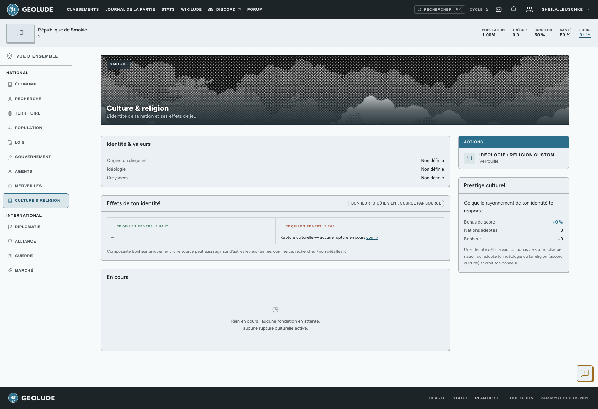

Au-delà des labels libres que tu poses sur l’écran **Identité de nation**,
ton pays peut adhérer à une **idéologie** ou une **religion** plus
structurée, fondée par toi ou par un autre joueur.

## Fonder ou rejoindre

Si ton pays est assez développé, tu peux **fonder** une idéologie ou une
religion originale, ou **rejoindre** celle d’un autre pays déjà fondée
dans la partie. Renommer une idéologie/religion que tu as fondée est
possible, mais encadré par un délai.

## Ce que ton identité te rapporte

Une décomposition chiffrée montre l’effet de chaque source d’identité sur
ton **bonheur** : ton origine, ton idéologie, ta religion, ton identité
personnalisée si tu en as fondé une, ton alliance, un accord culturel en
cours, ou une rupture culturelle active.

## Rupture culturelle

Un changement d’identité mal négocié peut déclencher une **rupture
culturelle** : un malus temporaire, affiché avec le nombre de cycles
restants avant qu’il ne s’efface.

## Prestige culturel

Une identité bien définie et adoptée par d’autres pays te rapporte un
**prestige culturel** : un bonus de score, et un rayonnement qui profite
aussi (un peu) aux pays qui te rejoignent.

> Les seuils d’éligibilité, les délais de renommage et les valeurs de
> bonus sont réglables par partie.

## Voir aussi

Doctrine, idéologie et trait dirigeant se posent sur l’écran **Identité
de nation** — ici, tu n’en vois qu’un résumé en lecture seule.
