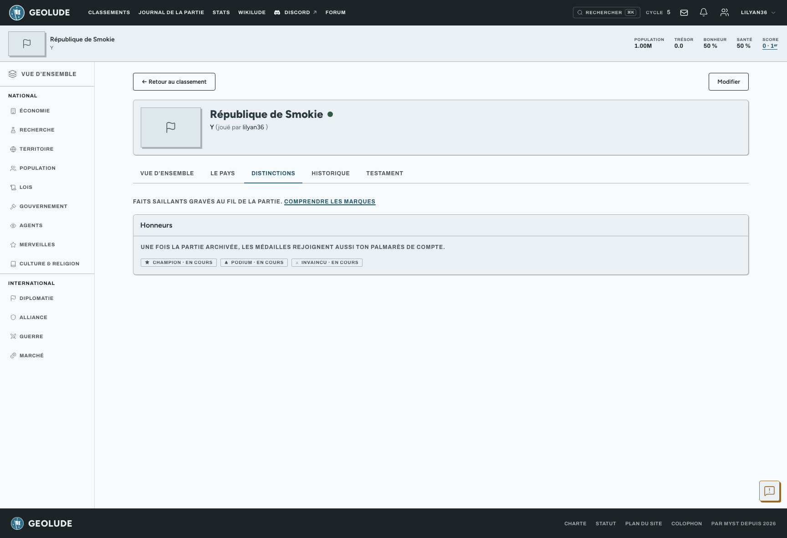

En plus de ton score, ton pays peut gagner des **distinctions** : des
marqueurs de ce que tu as accompli (ou pas) pendant la partie. Elles sont
visibles sur ta fiche pays publique, dans l’onglet **Distinctions**.

## Médailles

Les médailles récompensent un accomplissement précis : champion, podium,
invaincu, guerre menée sans perte, jamais baissé les impôts, allié
loyal… Une fois **verrouillée**, une médaille reste acquise pour
toujours, certaines seulement à la clôture de la partie.

Tant que la partie continue, certaines médailles peuvent apparaître en
**provisoires** : calculées en direct sur ta situation actuelle, elles
peuvent encore disparaître si ta situation change, jusqu’à ce qu’elles se
verrouillent.

## Marques

Les marques sont des traits durables gravés automatiquement au fil des
cycles selon ton comportement : guerrier redoutable, pacifiste,
agresseur, traître, autoritaire, réformateur, ou avoir mené ta merveille
à son terme. Certaines sont valorisantes, d’autres sont un stigmate — les
deux racontent ton histoire, pas seulement les bonnes.

Une nouvelle marque gagnée est signalée par une notification à ton retour
sur ton tableau de bord.

## Rivalités

Deux pays qui se sont fait la guerre plusieurs fois deviennent des
**rivaux historiques**, marqués comme tels sur leurs fiches respectives et
dans l’historique de la partie. C’est purement narratif : ça ne modifie
rien à tes statistiques, ça raconte juste un antagonisme qui dure.

## Voir aussi

Le score et le classement général vivent sur une fiche à part : les
distinctions ne comptent pas dans ton score, elles racontent une autre
partie de ton histoire.
