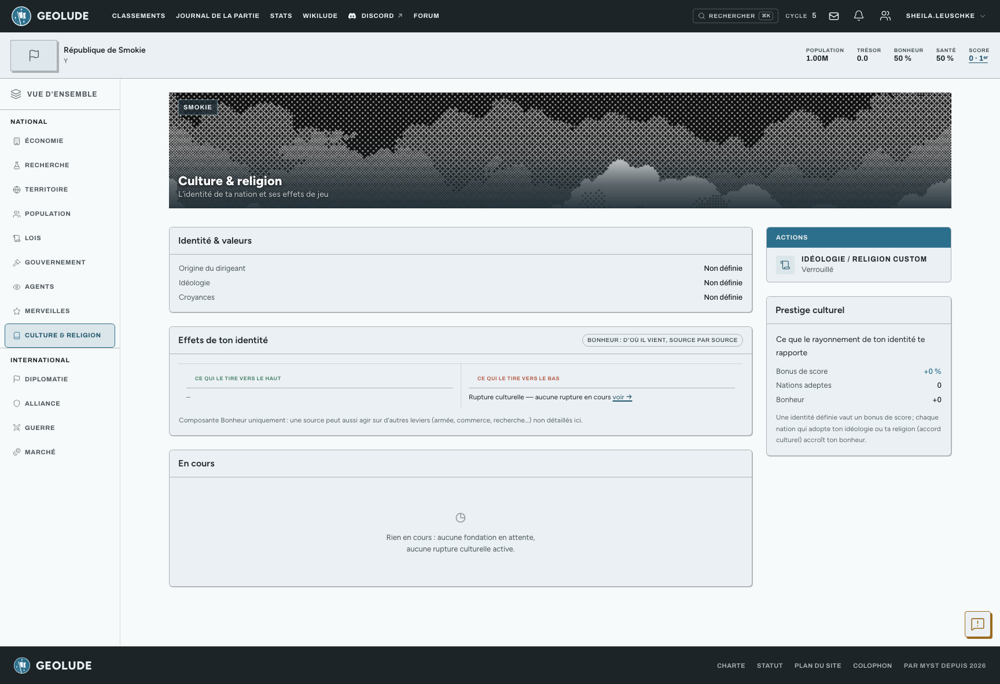

Au-delà des labels libres que tu poses sur l’écran **Identité de nation**,
ton pays peut adhérer à une **idéologie** ou une **religion** plus
structurée, fondée par toi ou par un autre joueur.

## Fonder ou rejoindre

Si ton pays est assez développé, tu peux **fonder** une idéologie ou une
religion originale : son bonus et son malus, tirés d’un catalogue fermé,
ne profitent qu’à toi, le fondateur. Renommer le libellé de ton idéologie
ou de ta religion est possible (que tu en aies fondé une ou non), mais
encadré par un délai.

Tu ne « rejoins » pas un pays de ta propre initiative : c’est lui qui
doit te **proposer un accord culturel** pour te faire adopter son
idéologie ou sa religion d’origine (l’archétype de base, pas la version
personnalisée qu’il a éventuellement fondée, dont l’effet reste réservé à
son fondateur) ; tu n’as plus qu’à l’accepter ou la refuser.

## Ce que ton identité te rapporte

Une décomposition chiffrée montre l’effet de chaque source d’identité sur
ton **bonheur** : ton origine, ton idéologie, ta religion, ton identité
personnalisée si tu en as fondé une, ton alliance, un accord culturel en
cours, ou une rupture culturelle active.

## Rupture culturelle

Un changement d’identité mal négocié peut déclencher une **rupture
culturelle** : un malus temporaire, affiché avec le nombre de cycles
restants avant qu’il ne s’efface.

## Prestige culturel

Une identité bien définie et adoptée par d’autres pays te rapporte un
**prestige culturel** : un bonus de score, et un rayonnement qui profite
aussi (un peu) aux pays qui te rejoignent.

> Les seuils d’éligibilité, les délais de renommage et les valeurs de
> bonus sont réglables par partie.

## Voir aussi

Doctrine, idéologie et trait dirigeant se posent sur l’écran **Identité
de nation**, ici, tu n’en vois qu’un résumé en lecture seule.
