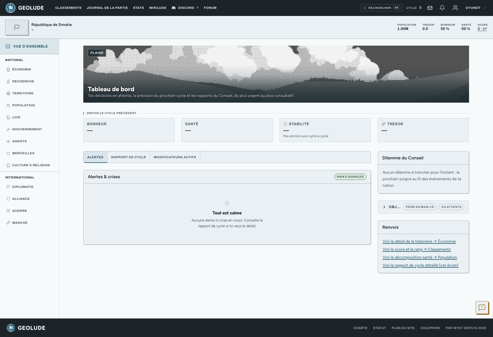

Ta situation est influencée par de nombreuses sources à la fois : ta
merveille, tes marques, tes lois, ta région, ta technologie avancée, une
éventuelle crise en cours. L’écran **Modificateurs actifs** les réunit
toutes en un seul endroit, en lecture seule.

## Les six sources

- **Merveille** : le bonus de ton type de merveille, si elle est assez
  grande.
- **Marques** : l’effet cumulé de tes marques gravées.
- **Technologie avancée** : les bonus de tes technologies avancées
  développées.
- **Région** : les bonus liés à la spécialité dominante de tes régions.
- **Lois** : l’effet net de tes lois actuellement décrétées.
- **Crise** : un éventuel malus lié à une crise en cours dans la partie.

Seules les sources qui ont un effet réel apparaissent : un facteur neutre
ne s’affiche pas, pour ne pas noyer ce qui compte vraiment.

## Pourquoi cet écran existe

Chaque effet est déjà visible ailleurs, décomposé dans l’écran qui le
concerne (ta merveille, tes lois, tes distinctions…). Celui-ci ne
recalcule rien : c’est juste la vue d’ensemble, utile avant une décision
qui dépend de ton total de bonus/malus plutôt que d’un détail précis.
